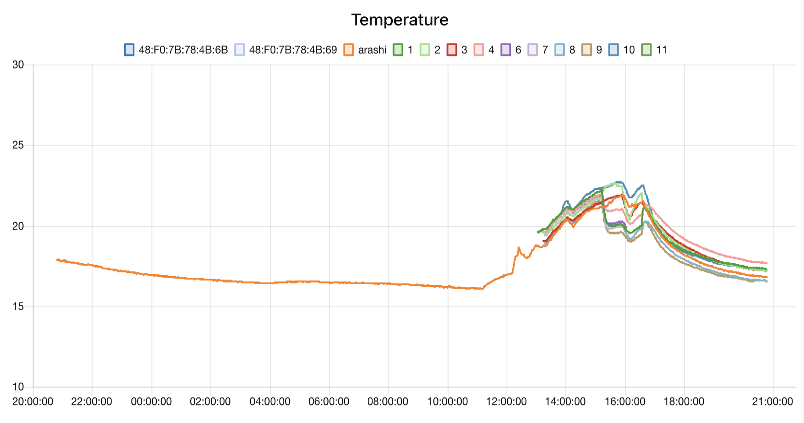
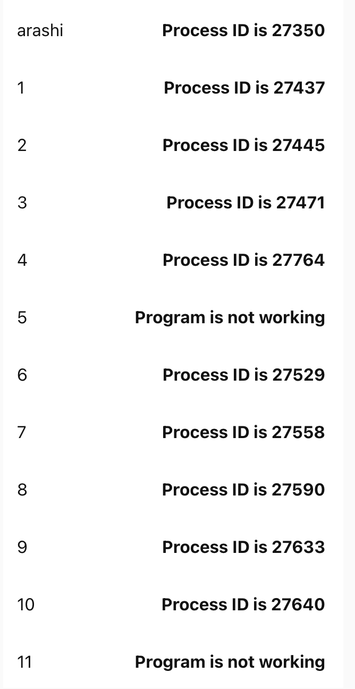

# SoNod Project
 
We can collect sensor data through this program.

Collected data is sent with MQTT.

*I do not write any code to save data in the local storage.*
*<br>I recommend using Node-RED to save any data.*


 
# Features
 
We can see all data in graph and which program is running with Node-RED.





# Requirement
 
This program requires these libraries.
 
* bluepy 1.3.0
* paho.mqtt 1.6.1
 
# Installation
 
 You can install all libraries using the code below.
 
```bash
pip3 install -r requirement.txt
```
*I recommend to use "pip3" to clear which version you use.*
 
# Usage
 
You can use this in the followin steps.
 
```bash
git clone https://github.com/ayaki-sugawara/sonod.git
cd sonod
python3 child.py (sensor_mac_addr) (place) (sensor_name)
```
* You do not have to write ":" in mac addr. This program automaticallly add them. 

*You can write like "48F07B784B6B", or "48:F0:7B:78:4C:6A" either.*

* You can give it any name you want.

## Node-RED

All environment data like temperature value are saved in data folder.

All status data, battery and RSSI value, are saved in status folder.

When you use flows.json, _DO NOT FORGET TO CHANGE FILE PATH_.
 
# Note
 
When you want to use multiple sensors, I recommend to use tmux.

```bash
sudo apt install tmux -y
```

In my experiment, Raspberry Pi can connect only 10 sensors at the same time.

When an error occur, try code below. Then, Restart All Program.

```bash
sudo bluetoothctl
power on
power off
```


 
# Author
 
* Ayaki Sugawara
* Westlab at Keio Univ.
* sugawara@west.sd.keio.ac.jp
 
