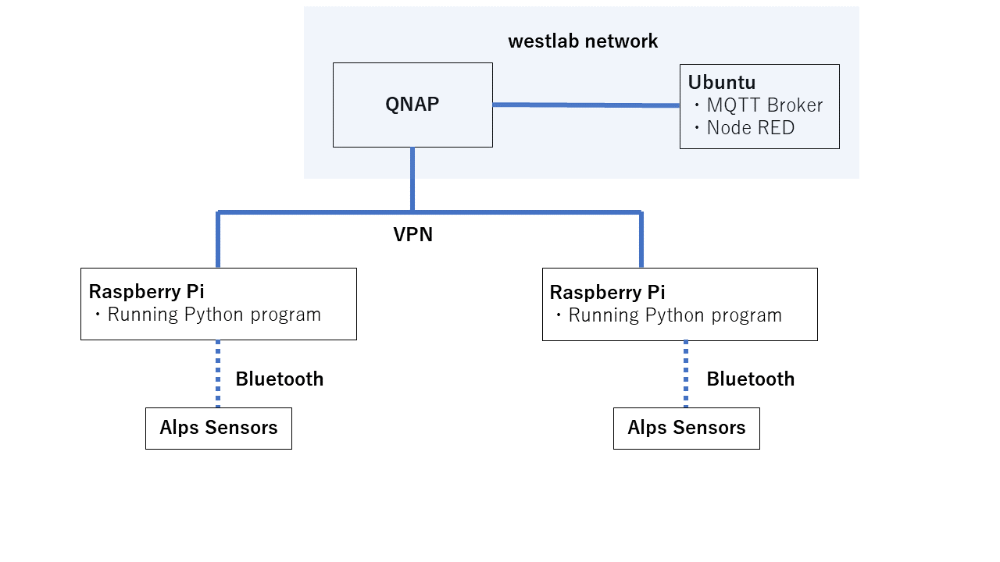

# SoNod Project
 
We can collect sensor data through this program.

Collected data is sent with MQTT.

*I do not write any code to save data in the local storage.*
*<br>I recommend using Node-RED to save any data.*


 
# Features
 
We can see all data in graph and which program is running with Node-RED.


# Requirement
 
This program requires these libraries.
 
* bluepy 1.3.0
* paho.mqtt 1.6.1
 
# Installation
 
 You can install all libraries using the code below.
 
```bash
pip3 install -r requirement.txt
```
*I recommend to use "pip3" to clear which version you use.*
 
# Usage
 
You can use this in the followin steps.
 
```bash
git clone https://github.com/ayaki-sugawara/sonod.git
cd sonod
python3 child.py (sensor_mac_addr) (place) (sensor_name)
```
* You do not have to write ":" in mac addr. This program automaticallly add them. 

*You can write like "48F07B784B6B", or "48:F0:7B:78:4C:6A" either.*

* You can give it any name you want.

## Node-RED

All environment data like temperature value are saved in data folder.

All status data, battery and RSSI value, are saved in status folder.

When you use flows.json, _DO NOT FORGET TO CHANGE FILE PATH_.
 
# Note
 
When you want to use multiple sensors, I recommend to use tmux.

```bash
sudo apt install tmux -y
```

In my experiment, Raspberry Pi can connect only 10 sensors at the same time.

When an error occur, try code below. Then, Restart All Program.

```bash
sudo bluetoothctl
power on
power off
```

# Detail Usage

The network configuration is as follows.



All Raspberry Pi just send the data to Ubuntu which is MQTT Broker and subscriber. Python program which runs in Pi do not save any data in the local storage.

JSON is used when sending data.

When sending the environment data, data is like as follows.

```bash
sendData = {
    "data": {
        "pressure": (Pressure),
        "humidity": (Humidity),
        "temperature: (Temperature),
        "uv": (uv),
        "ambientlight: (AmbientLight)
    },
    "sensor": (sensor name you assign),
    "timestamp": (ISO format timestamp YYYY-mm-ddTHH:MM:SS+09:00),
    "place": (place you decide)
}
```

When sending the status data, data is like
```bash
sendData={
    "battery": (battery value calculated by XXXX mV / 3300 * 100),
    "rssi": (rssi),
    "sensor": (sensor name),
    "place": (place)
}
```

Each data is sent to mqtt broker. Topic is "data" and "status" at each.

To save data and status value, you have to set up Node in Node RED.

By using template, you can do it easily.

What you have to do is just change file path in some nodes. 

I made comment nodes where you have to change.

And if you want to check the status of each program, you have to make nodes for that.

I have made some example nodes, so please check them.

## Control Alps Sensor
I made Sensor class to contorl an alps sensor easily.

To use this, 
```python
sensor = Sensor(mac_addr, sensorName, mqtt_publisher, placeName)
```
(But you can use this class easier by running child.py.)

When Sensor class is called, notifications for custom1 and custom2 are automatically enabled and process id of that program is sent to mqtt broker by using topic "state".

### initialize sensor

When you want to initialize a sensor, 
```python
sensor.initialize()
```

### setTime
When you want to sync time of sensor itself, 
```python
sensor.setTime()
```
*timezone is JST +09:00*

### Select Sampling Devices
You can select which sensors you want to use from *ambient light, uv, temperature, humidity, pressure, geo-magnetic, acceleration*.

You have to make a list which sensor you want to use.

list consists of 7 elements, and first element must be 0.

And each following elemet is 0 or 1 and sequence is same as I wrote above.

For example, you want to use only temperature and humidity sensors, list is like
```python
[0, 0, 0, 1, 1, 0, 0]
```
And to send command to the sensor, 
```python
sensor.selectSamplingDevices([0, 0, 0, 1, 1, 0, 0])
```

### Slow Mode
When you want to use slow mode, you have to decide interval [sec] of measurement.

And you just run, 
```python
sensor.setSlowMode(interval)
```

### Auto Status
Alps sensor enable you to notify its status like battery and RSSI every a minute.

When you want to use this option, 
```python
sensor.setAutoStatus()
```

### Contorl Measurement
When you want to start measurement, 
```python
sensor.controlMeasurement("start")
```
To stop,
```python
sensor.controlMeasurement("stop")
```
or 
```python
sensor.controlMeasurement()
```

### Disconnect
To disconnect a sensor, 
```python
sensor.disconnect()
```

### Sample Function

When you run main methods, it runs automatically
```python
self.setTime()
self.selectSamplingDevices([0,1,1,1,1,1,0,0])
self.setSlowMode(interval)
self.setAutoStatus()
self.controlMeasurement("start")
```
and fix time every 10 minutes.

Until you kill this process, all data is sent.

 
# Author
 
* Ayaki Sugawara
* Westlab at Keio Univ.
* sugawara@west.sd.keio.ac.jp
 
